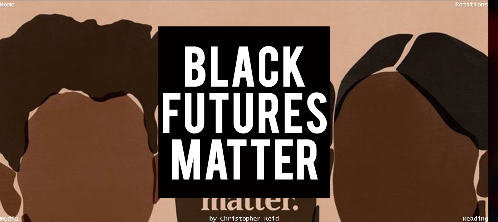
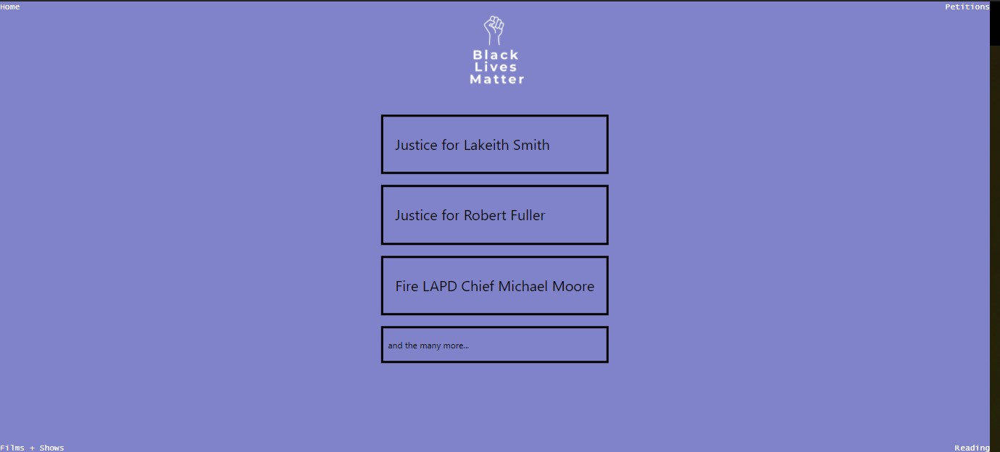
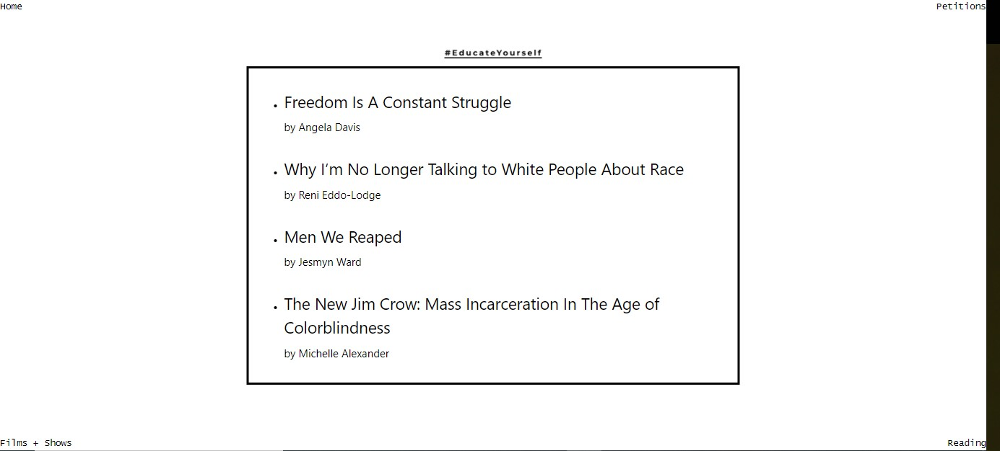
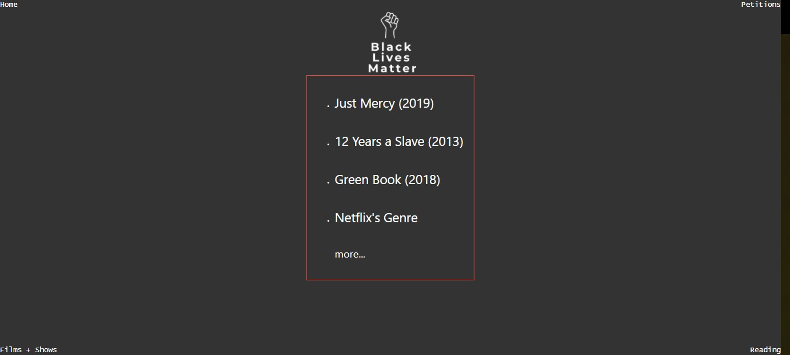

# BLM-Movement
This home project was to try to replicate Black Lives Matter website in HTML from scratch.
All information on pages has outbound links which direct the user to petions, books, and films.

#2. Petitions page, using top right link

#3. Reading Page, using bottom right link

#4. Reading Page, using bottom right link

